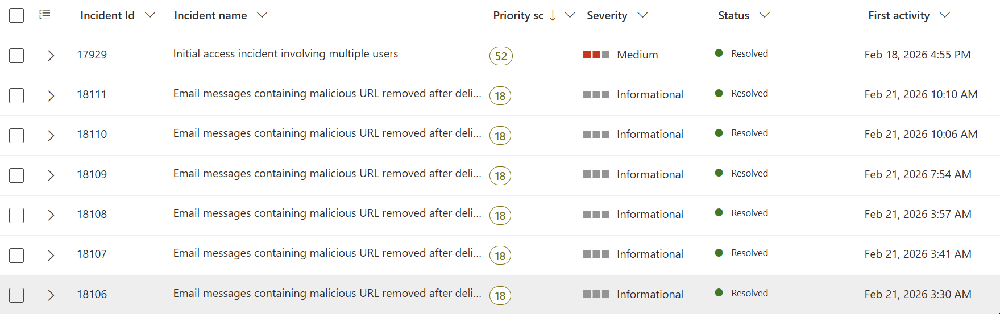
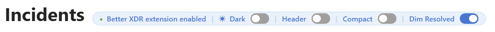
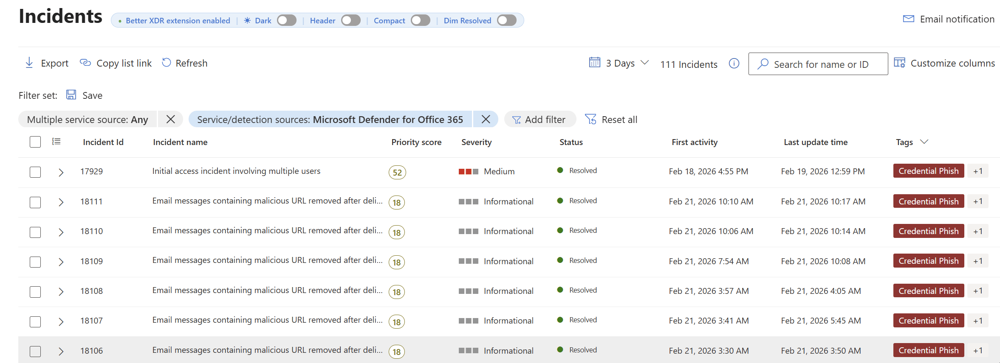
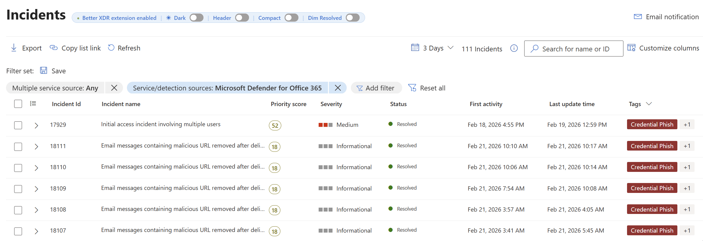

# Better MS XDR Extension

Simple browser extension that adds some tweaks to the Microsoft Defender XDR incidents interface to enhance usability (in my opinion :) )

**Disclaimer:** This extension relies on Microsoft Defender XDR's DOM structure. UI changes from Microsoft may break it at any time. If something stops working, please [open an issue](../../issues).

**AI Disclaimer:** This extension was *mostly* vibe-coded.

## Features

- **Multi-column sorting** - Saves a click by sorting columns when click the header. Supported columns: Incident ID, Incident Name, Top Risk, Severity, Status, First Event Time, Last Event Time, and Last Update Time. A sort indicator (▲/▼) appears inline with the active column header. Clicking cycles through descending → ascending → off.
- **Dark/light mode toggle** - Switch the portal theme from any page via the in-page banner or the extension popup, without having to navigate to the homepage.
- **Incidents header toggle** - Show or hide the message bar header on the incidents page to reclaim vertical space.
- **Compact mode** - Reduce row height in the incidents queue to fit more incidents on screen at once.
- **Dim resolved incidents** - Visually de-emphasise resolved incidents by reducing their opacity so active incidents stand out.
- **Scroll-to-top button** - A floating button appears in the bottom-right corner after scrolling down in the incidents queue. Clicking it smoothly scrolls back to the top.

All settings persist across sessions via extension storage and sync immediately between the popup and the in-page banner.

## Preview

<details>

<summary>Column sorting</summary>



</details>

<details>

<summary>Banner settings</summary>



</details>

<details>

<summary>Compact mode</summary>



</details>

<details>

<summary>Dim resolved</summary>



</details>

<details>

<summary>Scroll to tops</summary>


</details>


## Building

```bash
./scripts/build.sh
```

This assembles `dist/firefox/` and `dist/chrome/` from the sources in `src/`. Run this once before loading the extension, and again after any source changes.

Pre-built zips are attached to each [GitHub Release](../../releases) and can be unzipped and loaded directly.

## Installation

### Chrome

1. Clone this repository and run `./scripts/build.sh`
2. Open `chrome://extensions`
3. Enable **Developer mode**
4. Click **Load unpacked** and select the `dist/chrome/` directory

### Firefox

1. Clone this repository and run `./scripts/build.sh`
2. Open `about:debugging#/runtime/this-firefox`
3. Click **Load Temporary Add-on** and select any file inside the `dist/firefox/` directory

## How It Works

The extension injects a content script into `https://security.microsoft.com` that:

- **Sorting** - Adds a clickable sort control to each supported column header (Incident ID, Name, Top Risk, Severity, Status, and three time columns). Clicking a header cycles through descending → ascending → off; switching to a different column resets the previous one. Fluent UI virtualizes rows (loading and unloading them as you scroll), so the extension uses CSS `order` to reorder cells across virtual pages without touching the DOM tree React manages. This keeps alert expand/collapse working correctly.
- **Theme toggling** - A small bridge script (`theme-bridge.js`) runs in the page's main JavaScript world (required for localStorage access). On load it stamps the current theme onto `data-xdr-theme` on `<html>` so the content script can read it. When toggled, it reads the `localConfig-prefersTheme-*` localStorage key, flips the `value` field between `"dark"` and `"light"`, and reloads the page.
- **Header visibility** - Hides or shows the element immediately following the message bar container by toggling `display: none`.
- **Compact mode** - Applies a CSS class (`xdr-compact-mode`) to `<html>` that reduces incident row height via the content stylesheet.
- **Dim resolved** - After each sort or scroll, scans visible incident rows and applies an `xdr-resolved` CSS class to any row whose status is "Resolved", reducing its opacity.
- **Scroll-to-top button** - A `position: fixed` button is injected into `document.body` and tracked via a scroll listener on the incidents list's scrollable ancestor. It becomes visible (opacity transition) once the scroll position exceeds 300px and is removed on teardown.

## Project Structure

```
src/
  shared/           # Single source for all shared files
    content.js
    content.css
    theme-bridge.js
    popup.html/js/css

  firefox/          # Firefox-specific (MV2 manifest + SVG icons)
    manifest.json
    icons/

  chrome/           # Chrome-specific (MV3 manifest + PNG icons)
    manifest.json
    icons/

scripts/
  build.sh          # Assembles dist/ from src/

dist/               # Built output (gitignored)
  firefox/          # Load this in Firefox
  chrome/           # Load this in Chrome
```

## Browser Support

| Browser | Manifest Version | Min Version |
|---------|-----------------|-------------|
| Chrome  | V3              | -           |
| Firefox | V3              | 109.0        |

## Permissions

The extension requests only one browser permission:

| Permission | Why |
|------------|-----|
| `storage` | Persists settings (enabled state, header visibility, compact mode, dim-resolved, current theme) across sessions and syncs them between the popup and the in-page banner via `chrome.storage.local` / `browser.storage.local` |

## Contributing

To get started:

1. Fork the repository and clone it locally
2. Run `./scripts/build.sh` to populate `dist/`
3. Load the extension in developer mode (see [Installation](#installation))
4. Edit files in `src/shared/`, `src/firefox/`, or `src/chrome/` as needed
5. Re-run `./scripts/build.sh` and reload the extension to pick up changes
6. Open a pull request with a clear description of what the change does and why

## License

MIT License - see [LICENSE](LICENSE) for details.
